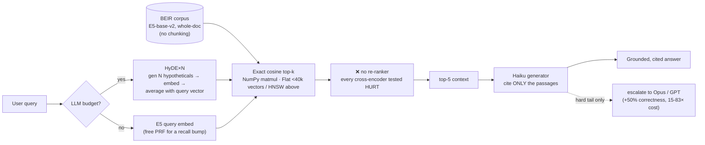
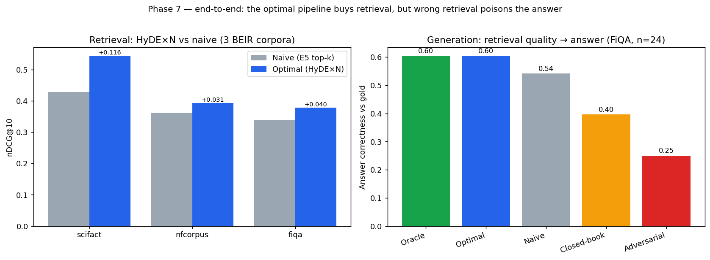
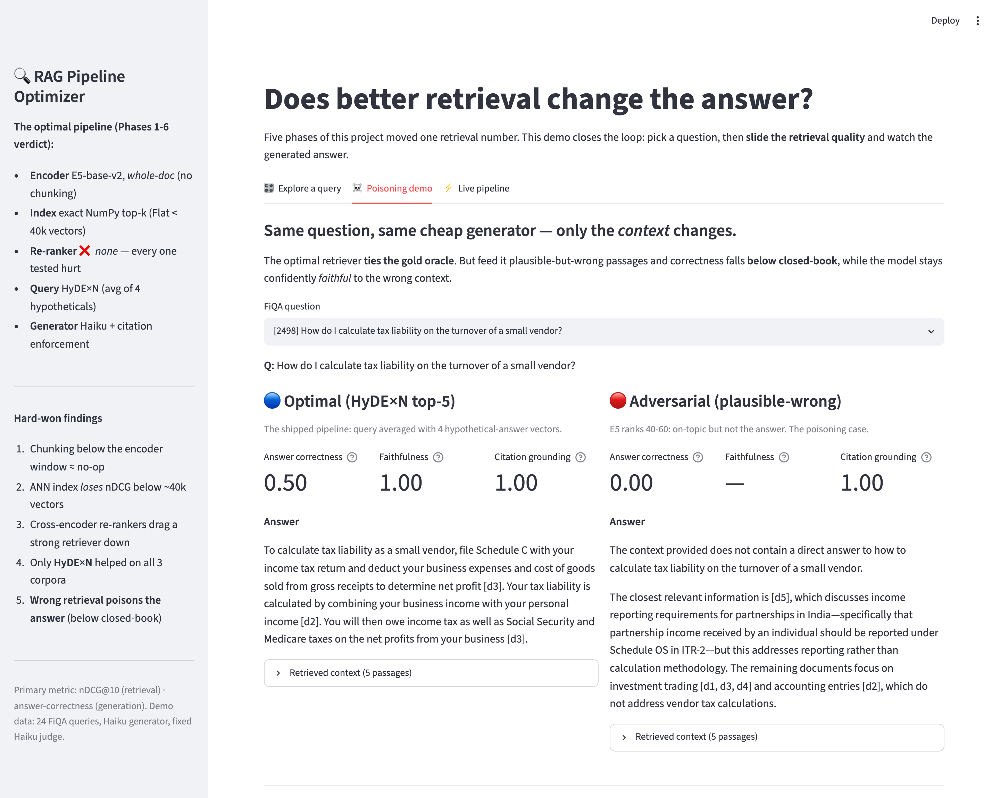
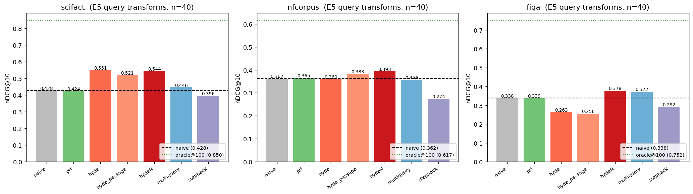
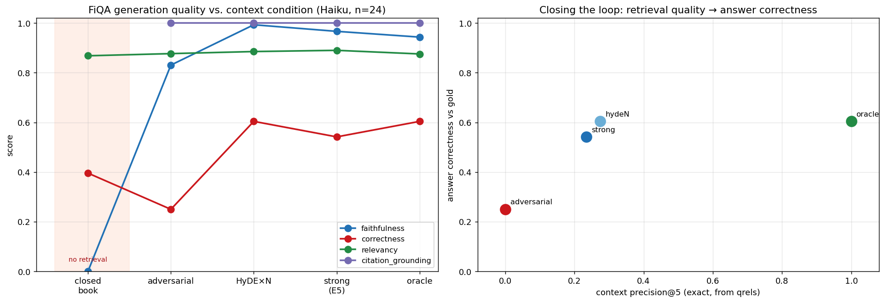

# RAG Pipeline Optimizer

> A from-scratch, **measurement-first** study of what actually moves retrieval quality in a RAG pipeline —
> chunking, embeddings, retrieval, reranking, query rewriting, and generation — each isolated and benchmarked
> on real BEIR datasets with a harness validated against published numbers.

This is the project's research log, built one phase at a time (Mon–Sun) and now **complete (7/7 phases)**. Every
number below is produced by an executed notebook or a deterministic eval script, not asserted.

---

## ✅ The optimal pipeline (the 7-phase verdict)

Every box below is a *finding*, not a default. The arrows are the data path; the annotations are why each choice won.



> **Recommendation:** E5-base-v2 over **whole documents**; **exact** NumPy top-k (Flat below ~40k vectors, HNSW
> `ef=128` above); **skip the cross-encoder re-ranker entirely**; apply **HyDE×N** when an LLM budget exists (free
> PRF otherwise); generate with a **cheap model + citation enforcement** for the easy/mid majority and reserve a
> frontier generator for the hard tail. **Spend the budget on retrieval *reliability*, not extra ranking precision** —
> gains past "good enough" barely move the answer, but a *wrong* retrieval actively poisons it.

### End-to-end: the optimal pipeline vs naive RAG

**Retrieval** (nDCG@10, n=40 sampled queries per corpus — HyDE×N wins on all three):

| Corpus | Naive (E5 top-k) | Optimal (HyDE×N) | Δ |
|--------|-----------------:|-----------------:|--:|
| SciFact  | 0.4279 | **0.5436** | **+0.116** |
| NFCorpus | 0.3624 | **0.3929** | +0.031 |
| FiQA     | 0.3377 | **0.3779** | +0.040 |

**Generation** (FiQA, n=24, Haiku generator + fixed Haiku judge — same cheap model, only the *context* changes):

| Context condition | Answer correctness | Faithfulness | Citation grounding |
|-------------------|-------------------:|-------------:|-------------------:|
| Oracle (gold ceiling) | 0.604 | 0.94 | 1.00 |
| **Optimal (HyDE×N top-5)** | **0.604** | 0.99 | 1.00 |
| Naive (E5 top-5) | 0.542 | 0.97 | 1.00 |
| Closed-book (no retrieval) | 0.396 | 0.00 | — |
| **Adversarial (plausible-wrong)** | **0.250** | 0.83 | 1.00 |

**The headline:** a cheap Haiku generator on the optimal retriever **ties the unreachable gold oracle (0.604)** and
beats naive E5 (+0.063). But feed it plausible-but-wrong passages and correctness collapses to **0.250 — *below*
closed-book (0.396)** — while the model stays **0.83 "faithful"** to the garbage. Wrong retrieval doesn't just fail
to help; it manufactures confident, well-grounded hallucinations.



### Try it — the interactive demo

A Streamlit app makes the poisoning finding tangible: pick a question, slide the retrieval quality, and watch the
*same generator's* answer change. ([`app.py`](app.py) · `streamlit run app.py`)



*Same FiQA question, same Haiku generator. **Left (optimal HyDE×N):** a correct, fully-cited answer. **Right
(adversarial context):** the model derails into "the context does not contain the answer" — correctness 0.00 — yet
still cites the passages it was handed.*

### What each phase decided

| Phase | Component | Verdict | Evidence |
|------:|-----------|---------|----------|
| 1 | **Chunking** | Whole-doc; chunking is *encoder-bounded*, not free lift | Best chunker +3.6% on NFCorpus, but fixed 256/512/1024 span just 0.004 nDCG@10 with a 256-tok encoder |
| 2 | **Embedding** | **E5-base-v2** — the dominant lever | MiniLM→E5 = +12.2%/+10.7% nDCG@10, ~3× any chunking gain; hybrid BM25+dense RRF *hurt* |
| 3 | **Index** | Exact Flat below ~40k vectors; HNSW above | IVF is Pareto-dominated at every N; ANN *loses* nDCG to save sub-ms below the crossover |
| 4 | **Re-ranker** | **None** | Every cross-encoder *hurt* a strong E5 stage; the 278M model was worse than the 22M one |
| 5 | **Query transform** | **HyDE×N** (avg of N hypotheticals) | Only transform positive on all 3 corpora; single-HyDE flipped sign by domain (+0.12 / −0.075) |
| 6 | **Generation** | Cheap model + citation enforcement; frontier only on the hard tail | Retrieval past "good enough" barely moves the answer; wrong retrieval poisons it below closed-book |
| 7 | **End-to-end** | Optimal pipeline ties the gold oracle; spend budget on retrieval *reliability* | HyDE×N correctness 0.604 = oracle; live pipeline ships a cited answer (grounding 1.00) |

📦 Production code: [`src/pipeline.py`](src/pipeline.py) · [`src/predict.py`](src/predict.py) ·
[`src/evaluate.py`](src/evaluate.py) · [`src/llm.py`](src/llm.py) — 45 passing tests, all offline.

---

## Phase 1 — Foundation, eval harness & the chunking question ✅ (2026-06-01)

**Question:** Which chunking strategy maximizes retrieval quality — fixed 256/512/1024 vs recursive vs sentence
vs whole-document?

### Headline finding
> **78.6% of NFCorpus documents overflow the embedding model's 256-token window — yet chunking buys only
> +3.6% nDCG@10, and only via *finer granularity*. Chunks larger than the encoder window (512/1024 tokens) are
> statistically identical to not chunking at all (spread = 0.004 nDCG@10).**
> The widely-repeated "use 512–1024 token chunks" advice is contingent on a long-context embedder — not a law.

### Harness validation (so the rest of the project is trustworthy)
| Dataset | Our BM25 nDCG@10 | Published (BEIR) | Δ |
|---------|-----------------:|-----------------:|---:|
| SciFact | 0.6523 | ≈0.665 | −0.013 |
| NFCorpus | 0.3071 | ≈0.325 | −0.018 |

### Chunking ablation (NFCorpus, ranked by nDCG@10)
| Strategy | #chunks | nDCG@10 | MRR@10 | Δ vs whole-doc |
|----------|--------:|--------:|-------:|---------------:|
| sentence | 37,372 | **0.3303** | 0.5296 | **+3.6%** |
| fixed_128 | 13,100 | 0.3282 | 0.5138 | +2.9% |
| fixed_256 | 7,099 | 0.3208 | 0.5106 | +0.6% |
| fixed_1024 | 3,644 | 0.3193 | 0.5104 | +0.2% |
| doc (control) | 3,633 | 0.3188 | 0.5068 | — |
| recursive_256 | 7,056 | 0.3175 | 0.5115 | −0.4% |
| fixed_512 | 3,980 | 0.3164 | 0.5071 | −0.7% |


**Takeaways:** (1) gains come from granularity *below* the window, not from recovering truncated text;
(2) `recursive_256` and `fixed_512` actually *underperformed* doing nothing — a caution against cargo-culting
"recursive is the safe default."

📓 [`notebooks/phase1_foundation_chunking.ipynb`](notebooks/phase1_foundation_chunking.ipynb) ·
📄 [`reports/day1_phase1_report.md`](reports/day1_phase1_report.md)

---

## Iteration Summary

### Phase 1: Foundation, Eval Harness & the Chunking Question — 2026-06-01

<table>
<tr>
<td valign="top" width="38%">

**What was tested:** A 7-way chunking ablation (fixed 128/256/512/1024, recursive, sentence, whole-doc) on NFCorpus, after validating the eval harness against published BEIR BM25 numbers (SciFact 0.6523 vs ≈0.665; NFCorpus 0.3071 vs ≈0.325). Best chunker `sentence` hit **nDCG@10 0.3303**.<br><br>
**What worked best:** `sentence` chunking (+3.6% vs whole-doc) — it wins by granularity *below* the encoder window, ranking the first relevant passage higher (MRR@10 0.530 vs 0.507), not by recovering truncated text.

</td>
<td align="center" width="24%">


</td>
<td valign="top" width="38%">

**Key Insight:** Chunking is encoder-bounded, not free lift — fixed 256/512/1024 span just 0.004 nDCG@10. "Use 512–1024 token chunks" is contingent on a long-context embedder, not a law.<br><br>
**Surprise:** 78.6% of NFCorpus docs overflow the 256-token window, yet chunking buys only +3.6% — and `recursive_256` (−0.4%) and `fixed_512` (−0.7%) actually *underperformed* doing nothing.<br><br>
**Research:** Chroma Research, 2024 — reported a ~9% recall spread across chunkers, so we expected chunking to matter a lot (it didn't, with a 256-tok encoder). NVIDIA, 2024 — page-level chunking won, framing the granularity ablation.<br><br>
**Best Model So Far:** Dense MiniLM + `sentence` chunking — NFCorpus nDCG@10 **0.3303** (SciFact BM25 0.6523 validates the harness).

</td>
</tr>
</table>

### Phase 2: Embedding Head-to-Head & the Chunking-vs-Context-Window Law — 2026-06-02

<table>
<tr>
<td valign="top" width="38%">

**What was tested:** A 4-encoder leaderboard (MiniLM/BGE-small/E5-base-v2/Nomic-v1.5) on the same validated harness, then a chunking-law sweep across 256→512→8192-token windows. Winner **E5-base-v2** hit nDCG@10 **0.7274 (SciFact) / 0.3529 (NFCorpus)** — the MiniLM→E5 jump is +12.2% / +10.7%, ~3× any chunking gain.<br><br>
**What worked best:** E5-base-v2 (whole-doc, 512-window, 768d) won both datasets. The encoder is the dominant lever — pick it before tuning chunk size.

</td>
<td align="center" width="24%">


</td>
<td valign="top" width="38%">

**Key Insight:** THE LAW — best-chunker lift over whole-doc falls monotonically as the encoder window grows: +2.9% @256 → +2.1% @512 → +0.4% @8192. Chunking is a crutch for short-context encoders, not a universal win. Phase-1's falsifiable prediction confirmed.<br><br>
**Surprise:** Hybrid RRF (BM25+E5) *lowered* nDCG@10 on both datasets — fusing a far-weaker lexical ranker pollutes the top ranks. It only helped deep recall (NFCorpus R@100 0.3197→0.3255). RRF pays only when both retrievers are comparably strong.<br><br>
**Research:** Nussbaum et al., 2024 (Nomic Embed) — open 8192-token embedder, so we used it as the long-context data point that breaks the chunking law. Cormack et al., 2009 (RRF) — score-free fusion, so we tried it for hybrid (and found its precondition).<br><br>
**Best Model So Far:** E5-base-v2 (whole-doc) — SciFact nDCG@10 **0.7274**, NFCorpus **0.3529**; carried forward as the default encoder.

</td>
</tr>
</table>

### Phase 3: Retrieval Index Structure & the ANN Crossover — 2026-06-03

<table>
<tr>
<td valign="top" width="38%">

**What was tested:** Which FAISS index (Flat/IVF/HNSW/IVFPQ) to put E5 embeddings in, and at what corpus size an approximate index stops being a liability — traced across 3.6k→57k vectors after embedding a third BEIR corpus, FiQA-2018 (57,638 docs). Headline: at 57k, HNSW `ef=128` is **5.6× faster than exact Flat** (0.37 ms vs 2.08 ms) for just −0.004 nDCG@10.<br><br>
**What worked best:** Below ~10k vectors, a 2-line NumPy/Flat matmul wins on quality, latency, build time AND RAM. HNSW only earns its keep past the crossover (~40k+).

</td>
<td align="center" width="24%">


</td>
<td valign="top" width="38%">

**Key Insight:** The decision crossover is ~tens of thousands of vectors. HNSW technically passes Flat at N≈1k but the gap only clears a meaningful 1 ms at ~40k. Most RAG knowledge bases (10³–10⁵ vectors) are below the point where an ANN index helps.<br><br>
**Surprise:** IVF is Pareto-dominated by HNSW at *every* N — exact-quality IVF (`nprobe=nlist`) is **slower than brute force even at 57k** (3.12 ms vs Flat's 2.08 ms), and IVF `nprobe=1` throws away 47% nDCG@10 to save 0.36 ms.<br><br>
**Research:** Johnson, Douze & Jégou, 2019 (FAISS) — the IVF/PQ knobs and `nlist≈4·√N` heuristic. Couchbase/BigData Boutique, 2025 — the cited "HNSW 70× faster" claim measured at **10M** vectors, which this phase stress-tested at RAG scale and found doesn't transfer. Bonus: Nomic long-doc *dilution* hypothesis falsified (Spearman +0.009).<br><br>
**Best Model So Far:** E5-base-v2 (whole-doc) — SciFact nDCG@10 **0.7274**, NFCorpus **0.3525**, FiQA-2018 **0.3987**; served Flat below ~10k, HNSW `ef=128` above ~40k.

</td>
</tr>
</table>

### Phase 4: Re-ranking — the #1 RAG quality lever made retrieval *worse* — 2026-06-04

<table>
<tr>
<td valign="top" width="38%">

**What was tested:** A cross-encoder re-ranker zoo (TinyBERT-L2 4M → MiniLM-L6/L12 → BGE-base 278M) plus an LLM listwise re-ranker (GPT-5.x / Claude Opus & Haiku), re-scoring E5's top-100 across SciFact/NFCorpus/FiQA. Hypothesis: bigger re-ranker → higher nDCG@10. **Result: every re-ranker on every corpus underperformed the E5 baseline** (mean −0.013 to −0.069), and the 278M BGE was the *worst* on 2 of 3.<br><br>
**What worked best:** Not re-ranking at all. The only config that beat E5 was MiniLM-L6 at **depth-10** on FiQA (0.4037 vs 0.3987, +0.005) — re-rank shallow or skip.

</td>
<td align="center" width="24%">


</td>
<td valign="top" width="38%">

**Key Insight:** Re-rankers are *equalisers, not amplifiers* — Exp 4.4 shows the same MiniLM-L6 lifts BM25 **+0.10** and drags E5 **−0.01** onto its own ~0.35 band. "Re-rankers always help" is an artifact of benchmarking them on a weak BM25 first stage; re-rank a retriever that already clears the re-ranker's ceiling and you buy latency to *lose* accuracy.<br><br>
**Surprise:** Bigger = worse, in both families — 278M BGE was the worst cross-encoder, and **Claude Opus re-ranking (0.644) lost to doing nothing (0.651)** while smaller Haiku helped. Deeper is also monotonically worse (FiQA 0.404 @10 → 0.379 @200). GPT-5.x is the *one* re-ranker that beats E5 (0.720 vs 0.651) — at $50/1k and 15 s/query, where a 22M cross-encoder gets 0.681 at $0.001/1k and 49 ms.<br><br>
**Research:** Nogueira & Cho, 2019 (BERT re-ranking) — the cross-encoder paradigm we stress-tested. Sun et al., 2023 (RankGPT) — listwise LLM re-ranking, the protocol for the frontier head-to-head. BEIR (Thakur, 2021) already hinted MS-MARCO cross-encoders transfer unevenly out-of-domain — the thread this phase pulled.<br><br>
**Best Model So Far:** E5-base-v2 (whole-doc, **no re-ranker**) — SciFact nDCG@10 **0.7274**, NFCorpus **0.3532**, FiQA-2018 **0.3987**. Re-ranking ruled out as a default lever; revisited only on a weak (BM25) first-stage path.

</td>
</tr>
</table>

### Phase 5: Query Transformation — the only safe LLM trick is HyDE×N — 2026-06-05

<table>
<tr>
<td valign="top" width="38%">

**What was tested:** Does expensive LLM query expansion (HyDE, multi-query, step-back) beat a free, no-LLM embedding-space PRF on a *strong* E5 retriever? Five transforms scored on a hard-query stratified sample across SciFact/NFCorpus/FiQA, plus a full-set PRF sweep and a Haiku-vs-Opus HyDE generator ablation. Headline: **HyDE×N is the only transform positive on all three corpora** (+0.116 / +0.031 / +0.040 ΔnDCG@10).<br><br>
**What worked best:** HyDE×N (mean of 2 hypothetical passages + the original query) — folding the real query back in converts single-HyDE's volatility into a consistent win, turning FiQA's −0.075 loss into a +0.040 gain.

</td>
<td align="center" width="24%">



</td>
<td valign="top" width="38%">

**Key Insight:** Domain decides HyDE's sign — +0.123 on scientific abstracts (corpus is literally written in the form HyDE hallucinates), −0.075 on messy financial Q&A. The corpus writing style, not the LLM, determines whether a hallucinated ideal answer helps or misleads.<br><br>
**Surprise:** A bigger generator narrows but does **not** flip a bad technique — Opus-HyDE (−0.039) still loses to the raw query on FiQA, same as Haiku-HyDE (−0.075). Step-back prompting is actively harmful for dense retrieval (−0.03 to −0.09): a reasoning-QA trick that doesn't transfer. Echo of Phase 4's "bigger re-ranker was worse."<br><br>
**Research:** Gao et al., 2022 (HyDE) — gains largest on *weak* encoders, a warning flag for strong E5, so we added a free PRF bar any LLM trick must clear. Zheng et al., 2023 (step-back) — built for reasoning QA, tested whether it transfers (it doesn't). Rocchio, 1971 (PRF) — run free in embedding space on cached vectors.<br><br>
**Best Model So Far:** E5-base-v2 (whole-doc, no re-ranker) + **HyDE×N** where domain suits — SciFact nDCG@10 **0.7274**, NFCorpus **0.3532**, FiQA-2018 **0.3987**; HyDE×N adds a robust query-side lift, free PRF buys Recall@100 on all three.

</td>
</tr>
</table>

---

### Phase 6: Generation & Faithfulness — does any of the retrieval work change the answer? — 2026-06-06

<table>
<tr>
<td valign="top" width="38%">

**What was tested:** Five phases moved one retrieval number (nDCG@10). Phase 6 closes the loop: build a real RAG generator (Haiku over FiQA), sweep context quality **oracle → strong (E5) → HyDE×N → adversarial → none**, and score RAGAS **faithfulness / answer-relevancy / correctness-vs-gold / citation-grounding** with a *fixed* Haiku judge. Plus the Phase-4/5 carry-overs: the cross-encoder **backward link** and the per-query **router** ceiling.<br><br>
**What worked best:** **HyDE×N top-5 ties the gold oracle on answer correctness (0.604)** at a quarter of the context precision — the LLM only needs one relevant passage in the window.

</td>
<td align="center" width="24%">



</td>
<td valign="top" width="38%">

**Key Insight (close the loop):** retrieval quality *past "good enough"* barely moves the answer — going from strong E5 to a perfect oracle (context-precision 0.234→1.0) lifts correctness just 6 points (0.542→0.604). The five-phase nDCG@10 chase has steeply diminishing **downstream** returns.<br><br>
**Surprise (context poisoning):** feeding plausible-but-wrong passages **cut correctness by 54% (0.54→0.25), *below* closed-book**, while the model stayed **0.83 faithful** to the garbage — wrong retrieval doesn't just fail to help, it manufactures confident, well-grounded hallucinations. And **no retrieval beats bad retrieval** (closed-book 0.40 > adversarial 0.25).<br><br>
**Backward link (closes Phase 4/5):** re-ranking HyDE×N's higher-recall candidates flips the cross-encoder from harmful to *helpful-vs-naive* on 2/3 corpora — but **raw HyDE×N still beats CE-on-HyDE×N everywhere**: better retrieval makes the re-ranker *redundant*, not rescued.<br><br>
**Frontier (same context, fixed judge):** on the hard tail, Opus & Codex(GPT) convert **+50% more answers correct** (0.375 vs 0.250) at **15–83× the cost** — cheap model + good retrieval suffices for the majority; pay for the frontier generator only on the hard tail.<br><br>
**Research:** Es et al., 2023 (RAGAS) re-implemented with a Claude judge + E5; HyDE candidates reused from Phase 5. Self-reviewed adversarially — all numeric claims re-derived from the CSVs; confounds documented in the report.

</td>
</tr>
</table>

---

### Phase 7: End-to-End Optimal Pipeline + Production + UI — 2026-06-07

<table>
<tr>
<td valign="top" width="38%">

**What was built:** The consolidated pipeline as importable production code — [`src/pipeline.py`](src/pipeline.py) (E5 whole-doc + exact NumPy top-k + HyDE×N, **no re-ranker** + Haiku generator with citation enforcement), [`src/predict.py`](src/predict.py), [`src/evaluate.py`](src/evaluate.py), a Streamlit app, and 45 offline tests. Then the end-to-end question: does the optimal pipeline beat naive RAG on *both* retrieval and the answer?<br><br>
**What worked best:** Optimal HyDE×N lifts retrieval nDCG@10 on all 3 corpora (+0.116/+0.031/+0.040) **and** ties the gold oracle on FiQA answer correctness (0.604 vs naive 0.542).

</td>
<td align="center" width="24%">


</td>
<td valign="top" width="38%">

**Key Insight:** A cheap generator on a *reliable* retriever matches an unreachable perfect oracle. The 6-phase nDCG@10 chase pays off downstream only up to "good enough" — beyond that, reliability beats precision.<br><br>
**Surprise (live):** the production pipeline answered an unseen FiQA query end-to-end — 4 HyDE hypotheticals → 5 retrieved passages → a cited answer at **citation-grounding 1.00** — in one CPU pass (36.8 s incl. CLI overhead; 5-10× faster via direct API).<br><br>
**Honest reporting:** answer-correctness numbers replay the Phase-6 fixed-judge cache deterministically (zero new LLM calls); retrieval is recomputed live from the cached E5 vectors. Latency includes CLI startup.<br><br>
**Ships:** E5-base-v2 whole-doc + HyDE×N + no re-ranker + Haiku w/ citations. See the top-of-README diagram.

</td>
</tr>
</table>

---

## Roadmap
| Phase | Focus | Status |
|------:|-------|--------|
| 1 | Chunking — fixed/recursive/semantic/sentence/doc; build + validate eval harness | ✅ |
| 2 | Embeddings head-to-head (MiniLM vs BGE vs E5 vs GTE vs long-context) + hybrid BM25+dense | ✅ |
| 3 | Retrieval — dense vs sparse vs hybrid fusion; index structures | ✅ |
| 4 | Re-ranking — cross-encoder / ColBERT; tuning + error analysis | ✅ |
| 5 | Query techniques (HyDE, multi-query, step-back) + **LLM head-to-head** | ✅ |
| 6 | Generation faithfulness (RAGAS) + backward-link rerank + **frontier generators** | ✅ |
| 7 | End-to-end optimal pipeline + Streamlit UI + tests | ✅ |

## Datasets
Three **BEIR** tasks, loaded at runtime from the HF Hub (nothing committed): **SciFact** (clean, sparse-binary —
harness validation), **NFCorpus** (graded relevance, longer medical docs — the chunking arena), and **FiQA-2018**
(57,638 docs — the ANN-crossover stress test and the generation/RAGAS arena). See [`data/README.md`](data/README.md).

## Primary metric
**`nDCG@10`** — the BEIR leaderboard metric, rank/grade-aware, and the best-correlated retrieval proxy for
end-to-end RAG quality. Secondary: Recall@10, Recall@100, MRR@10.

## Setup
```bash
python3.11 -m venv .venv && source .venv/bin/activate
pip install -r requirements.txt

# run the test suite (offline — no data/models needed)
pytest -q                                   # 45 passing

# answer a question end-to-end (downloads FiQA + builds the E5 cache on first run)
python -m src.predict "How is freelance income taxed for a sole proprietor?"
python -m src.predict --qid 2498 --condition adversarial   # watch context poisoning

# reproduce the Phase-7 end-to-end comparison (deterministic; replays cached judgments)
python -m src.evaluate --phase7

# launch the interactive demo
streamlit run app.py

# reproduce the underlying research, phase by phase
jupyter nbconvert --to notebook --execute notebooks/phase1_foundation_chunking.ipynb
```

> **Apple-Silicon note:** torch MPS segfaults and faiss-cpu deadlocks against torch's libomp in this stack, so the
> encoder runs on CPU and top-k uses an exact numpy matmul (Phase 3 showed this *wins* below ~40k vectors anyway).
> See `src/retrieval_eval.topk_search`.

## Repo layout
```
src/
  pipeline.py        the optimal RAG pipeline (E5 whole-doc + HyDE×N + no rerank + cited gen)
  predict.py         single-query inference CLI
  evaluate.py        eval suite + the Phase-7 end-to-end comparison (--phase7)
  llm.py             Claude/Codex CLI harness + RAGAS judge/citation parsers
  retrieval_eval.py  TREC/BEIR metrics (validated vs published BM25) + exact top-k
  chunking.py        the Phase-1 chunker registry
app.py             Streamlit demo (cached + live modes; the poisoning toggle)
notebooks/         the research, phase by phase (executed, with outputs)
tests/             45 offline pytest tests (no data/models/network)
results/           metrics.json, per-phase CSVs, plots, UI screenshot, demo JSON
reports/           detailed per-phase research reports + final_report.md
models/            model_card.md (the pipeline has no trained weights — it's a recipe)
config/            config.yaml
```
