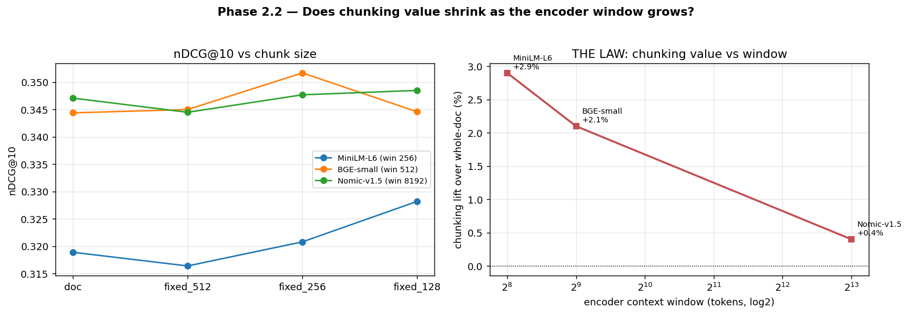
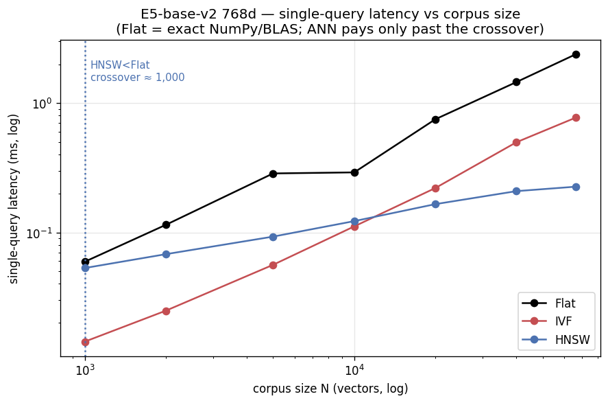
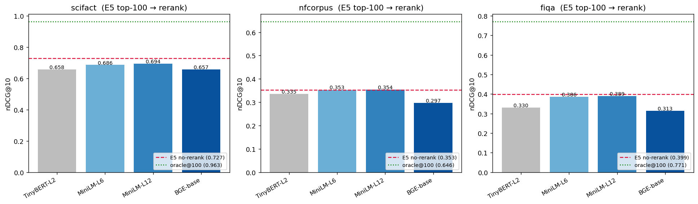

# RAG Pipeline Optimizer

> A from-scratch, **measurement-first** study of what actually moves retrieval quality in a RAG pipeline —
> chunking, embeddings, retrieval, reranking, query rewriting, and generation — each isolated and benchmarked
> on real BEIR datasets with a harness validated against published numbers.

This is the project's research log, built one phase at a time (Mon–Sun). Every number below is produced by an
executed notebook, not asserted.

---

## Phase 1 — Foundation, eval harness & the chunking question ✅ (2026-06-01)

**Question:** Which chunking strategy maximizes retrieval quality — fixed 256/512/1024 vs recursive vs sentence
vs whole-document?

### Headline finding
> **78.6% of NFCorpus documents overflow the embedding model's 256-token window — yet chunking buys only
> +3.6% nDCG@10, and only via *finer granularity*. Chunks larger than the encoder window (512/1024 tokens) are
> statistically identical to not chunking at all (spread = 0.004 nDCG@10).**
> The widely-repeated "use 512–1024 token chunks" advice is contingent on a long-context embedder — not a law.

### Harness validation (so the rest of the project is trustworthy)
| Dataset | Our BM25 nDCG@10 | Published (BEIR) | Δ |
|---------|-----------------:|-----------------:|---:|
| SciFact | 0.6523 | ≈0.665 | −0.013 |
| NFCorpus | 0.3071 | ≈0.325 | −0.018 |

### Chunking ablation (NFCorpus, ranked by nDCG@10)
| Strategy | #chunks | nDCG@10 | MRR@10 | Δ vs whole-doc |
|----------|--------:|--------:|-------:|---------------:|
| sentence | 37,372 | **0.3303** | 0.5296 | **+3.6%** |
| fixed_128 | 13,100 | 0.3282 | 0.5138 | +2.9% |
| fixed_256 | 7,099 | 0.3208 | 0.5106 | +0.6% |
| fixed_1024 | 3,644 | 0.3193 | 0.5104 | +0.2% |
| doc (control) | 3,633 | 0.3188 | 0.5068 | — |
| recursive_256 | 7,056 | 0.3175 | 0.5115 | −0.4% |
| fixed_512 | 3,980 | 0.3164 | 0.5071 | −0.7% |


**Takeaways:** (1) gains come from granularity *below* the window, not from recovering truncated text;
(2) `recursive_256` and `fixed_512` actually *underperformed* doing nothing — a caution against cargo-culting
"recursive is the safe default."

📓 [`notebooks/phase1_foundation_chunking.ipynb`](notebooks/phase1_foundation_chunking.ipynb) ·
📄 [`reports/day1_phase1_report.md`](reports/day1_phase1_report.md)

---

## Iteration Summary

### Phase 1: Foundation, Eval Harness & the Chunking Question — 2026-06-01

<table>
<tr>
<td valign="top" width="38%">

**What was tested:** A 7-way chunking ablation (fixed 128/256/512/1024, recursive, sentence, whole-doc) on NFCorpus, after validating the eval harness against published BEIR BM25 numbers (SciFact 0.6523 vs ≈0.665; NFCorpus 0.3071 vs ≈0.325). Best chunker `sentence` hit **nDCG@10 0.3303**.<br><br>
**What worked best:** `sentence` chunking (+3.6% vs whole-doc) — it wins by granularity *below* the encoder window, ranking the first relevant passage higher (MRR@10 0.530 vs 0.507), not by recovering truncated text.

</td>
<td align="center" width="24%">


</td>
<td valign="top" width="38%">

**Key Insight:** Chunking is encoder-bounded, not free lift — fixed 256/512/1024 span just 0.004 nDCG@10. "Use 512–1024 token chunks" is contingent on a long-context embedder, not a law.<br><br>
**Surprise:** 78.6% of NFCorpus docs overflow the 256-token window, yet chunking buys only +3.6% — and `recursive_256` (−0.4%) and `fixed_512` (−0.7%) actually *underperformed* doing nothing.<br><br>
**Research:** Chroma Research, 2024 — reported a ~9% recall spread across chunkers, so we expected chunking to matter a lot (it didn't, with a 256-tok encoder). NVIDIA, 2024 — page-level chunking won, framing the granularity ablation.<br><br>
**Best Model So Far:** Dense MiniLM + `sentence` chunking — NFCorpus nDCG@10 **0.3303** (SciFact BM25 0.6523 validates the harness).

</td>
</tr>
</table>

### Phase 2: Embedding Head-to-Head & the Chunking-vs-Context-Window Law — 2026-06-02

<table>
<tr>
<td valign="top" width="38%">

**What was tested:** A 4-encoder leaderboard (MiniLM/BGE-small/E5-base-v2/Nomic-v1.5) on the same validated harness, then a chunking-law sweep across 256→512→8192-token windows. Winner **E5-base-v2** hit nDCG@10 **0.7274 (SciFact) / 0.3529 (NFCorpus)** — the MiniLM→E5 jump is +12.2% / +10.7%, ~3× any chunking gain.<br><br>
**What worked best:** E5-base-v2 (whole-doc, 512-window, 768d) won both datasets. The encoder is the dominant lever — pick it before tuning chunk size.

</td>
<td align="center" width="24%">



</td>
<td valign="top" width="38%">

**Key Insight:** THE LAW — best-chunker lift over whole-doc falls monotonically as the encoder window grows: +2.9% @256 → +2.1% @512 → +0.4% @8192. Chunking is a crutch for short-context encoders, not a universal win. Phase-1's falsifiable prediction confirmed.<br><br>
**Surprise:** Hybrid RRF (BM25+E5) *lowered* nDCG@10 on both datasets — fusing a far-weaker lexical ranker pollutes the top ranks. It only helped deep recall (NFCorpus R@100 0.3197→0.3255). RRF pays only when both retrievers are comparably strong.<br><br>
**Research:** Nussbaum et al., 2024 (Nomic Embed) — open 8192-token embedder, so we used it as the long-context data point that breaks the chunking law. Cormack et al., 2009 (RRF) — score-free fusion, so we tried it for hybrid (and found its precondition).<br><br>
**Best Model So Far:** E5-base-v2 (whole-doc) — SciFact nDCG@10 **0.7274**, NFCorpus **0.3529**; carried forward as the default encoder.

</td>
</tr>
</table>

### Phase 3: Retrieval Index Structure & the ANN Crossover — 2026-06-03

<table>
<tr>
<td valign="top" width="38%">

**What was tested:** Which FAISS index (Flat/IVF/HNSW/IVFPQ) to put E5 embeddings in, and at what corpus size an approximate index stops being a liability — traced across 3.6k→57k vectors after embedding a third BEIR corpus, FiQA-2018 (57,638 docs). Headline: at 57k, HNSW `ef=128` is **5.6× faster than exact Flat** (0.37 ms vs 2.08 ms) for just −0.004 nDCG@10.<br><br>
**What worked best:** Below ~10k vectors, a 2-line NumPy/Flat matmul wins on quality, latency, build time AND RAM. HNSW only earns its keep past the crossover (~40k+).

</td>
<td align="center" width="24%">



</td>
<td valign="top" width="38%">

**Key Insight:** The decision crossover is ~tens of thousands of vectors. HNSW technically passes Flat at N≈1k but the gap only clears a meaningful 1 ms at ~40k. Most RAG knowledge bases (10³–10⁵ vectors) are below the point where an ANN index helps.<br><br>
**Surprise:** IVF is Pareto-dominated by HNSW at *every* N — exact-quality IVF (`nprobe=nlist`) is **slower than brute force even at 57k** (3.12 ms vs Flat's 2.08 ms), and IVF `nprobe=1` throws away 47% nDCG@10 to save 0.36 ms.<br><br>
**Research:** Johnson, Douze & Jégou, 2019 (FAISS) — the IVF/PQ knobs and `nlist≈4·√N` heuristic. Couchbase/BigData Boutique, 2025 — the cited "HNSW 70× faster" claim measured at **10M** vectors, which this phase stress-tested at RAG scale and found doesn't transfer. Bonus: Nomic long-doc *dilution* hypothesis falsified (Spearman +0.009).<br><br>
**Best Model So Far:** E5-base-v2 (whole-doc) — SciFact nDCG@10 **0.7274**, NFCorpus **0.3525**, FiQA-2018 **0.3987**; served Flat below ~10k, HNSW `ef=128` above ~40k.

</td>
</tr>
</table>

### Phase 4: Re-ranking — the #1 RAG quality lever made retrieval *worse* — 2026-06-04

<table>
<tr>
<td valign="top" width="38%">

**What was tested:** A cross-encoder re-ranker zoo (TinyBERT-L2 4M → MiniLM-L6/L12 → BGE-base 278M) plus an LLM listwise re-ranker (GPT-5.x / Claude Opus & Haiku), re-scoring E5's top-100 across SciFact/NFCorpus/FiQA. Hypothesis: bigger re-ranker → higher nDCG@10. **Result: every re-ranker on every corpus underperformed the E5 baseline** (mean −0.013 to −0.069), and the 278M BGE was the *worst* on 2 of 3.<br><br>
**What worked best:** Not re-ranking at all. The only config that beat E5 was MiniLM-L6 at **depth-10** on FiQA (0.4037 vs 0.3987, +0.005) — re-rank shallow or skip.

</td>
<td align="center" width="24%">



</td>
<td valign="top" width="38%">

**Key Insight:** Re-rankers are *equalisers, not amplifiers* — Exp 4.4 shows the same MiniLM-L6 lifts BM25 **+0.10** and drags E5 **−0.01** onto its own ~0.35 band. "Re-rankers always help" is an artifact of benchmarking them on a weak BM25 first stage; re-rank a retriever that already clears the re-ranker's ceiling and you buy latency to *lose* accuracy.<br><br>
**Surprise:** Bigger = worse, in both families — 278M BGE was the worst cross-encoder, and **Claude Opus re-ranking (0.644) lost to doing nothing (0.651)** while smaller Haiku helped. Deeper is also monotonically worse (FiQA 0.404 @10 → 0.379 @200). GPT-5.x is the *one* re-ranker that beats E5 (0.720 vs 0.651) — at $50/1k and 15 s/query, where a 22M cross-encoder gets 0.681 at $0.001/1k and 49 ms.<br><br>
**Research:** Nogueira & Cho, 2019 (BERT re-ranking) — the cross-encoder paradigm we stress-tested. Sun et al., 2023 (RankGPT) — listwise LLM re-ranking, the protocol for the frontier head-to-head. BEIR (Thakur, 2021) already hinted MS-MARCO cross-encoders transfer unevenly out-of-domain — the thread this phase pulled.<br><br>
**Best Model So Far:** E5-base-v2 (whole-doc, **no re-ranker**) — SciFact nDCG@10 **0.7274**, NFCorpus **0.3532**, FiQA-2018 **0.3987**. Re-ranking ruled out as a default lever; revisited only on a weak (BM25) first-stage path.

</td>
</tr>
</table>

---

## Roadmap
| Phase | Focus | Status |
|------:|-------|--------|
| 1 | Chunking — fixed/recursive/semantic/sentence/doc; build + validate eval harness | ✅ |
| 2 | Embeddings head-to-head (MiniLM vs BGE vs E5 vs GTE vs long-context) + hybrid BM25+dense | ✅ |
| 3 | Retrieval — dense vs sparse vs hybrid fusion; index structures | ✅ |
| 4 | Re-ranking — cross-encoder / ColBERT; tuning + error analysis | ✅ |
| 5 | Query techniques (HyDE, multi-query, step-back) + **LLM head-to-head** | ⏳ |
| 6 | Generation faithfulness (RAGAS) + production pipeline | ⏳ |
| 7 | End-to-end optimal pipeline + Streamlit UI + tests | ⏳ |

## Datasets
Two **BEIR** tasks, loaded at runtime from the HF Hub (nothing committed): **SciFact** (clean, sparse-binary —
harness validation) and **NFCorpus** (graded relevance, longer medical docs — the chunking arena).
See [`data/README.md`](data/README.md).

## Primary metric
**`nDCG@10`** — the BEIR leaderboard metric, rank/grade-aware, and the best-correlated retrieval proxy for
end-to-end RAG quality. Secondary: Recall@10, Recall@100, MRR@10.

## Setup
```bash
python3.11 -m venv .venv && source .venv/bin/activate
pip install -r requirements.txt
jupyter nbconvert --to notebook --execute notebooks/phase1_foundation_chunking.ipynb
```

> **Apple-Silicon note:** torch MPS segfaults and faiss-cpu deadlocks against torch's libomp in this stack, so
> the encoder runs on CPU and top-k uses an exact numpy matmul (corpora ≤ 20k vectors). See
> `src/retrieval_eval.topk_search`.

## Repo layout
```
src/            reusable harness (retrieval_eval.py) + chunkers (chunking.py)
notebooks/      the research, phase by phase (executed, with outputs)
results/        metrics.json, CSVs, plots
reports/        detailed per-phase research reports
config/         config.yaml
```
