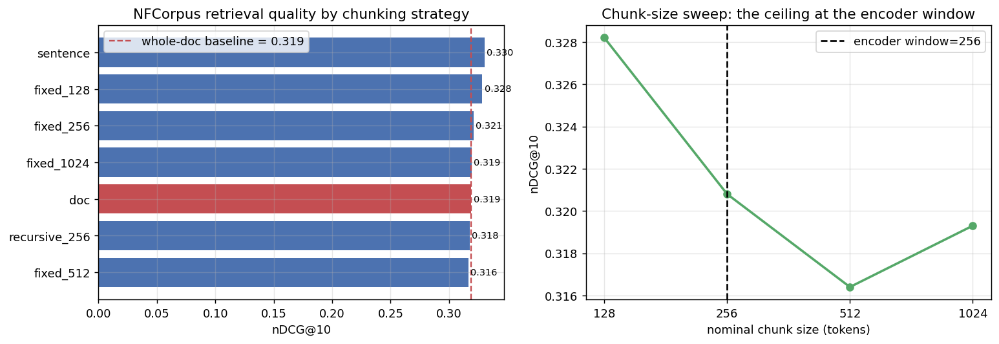

# RAG Pipeline Optimizer

> A from-scratch, **measurement-first** study of what actually moves retrieval quality in a RAG pipeline —
> chunking, embeddings, retrieval, reranking, query rewriting, and generation — each isolated and benchmarked
> on real BEIR datasets with a harness validated against published numbers.

This is the project's research log, built one phase at a time (Mon–Sun). Every number below is produced by an
executed notebook, not asserted.

---

## Phase 1 — Foundation, eval harness & the chunking question ✅ (2026-06-01)

**Question:** Which chunking strategy maximizes retrieval quality — fixed 256/512/1024 vs recursive vs sentence
vs whole-document?

### Headline finding
> **78.6% of NFCorpus documents overflow the embedding model's 256-token window — yet chunking buys only
> +3.6% nDCG@10, and only via *finer granularity*. Chunks larger than the encoder window (512/1024 tokens) are
> statistically identical to not chunking at all (spread = 0.004 nDCG@10).**
> The widely-repeated "use 512–1024 token chunks" advice is contingent on a long-context embedder — not a law.

### Harness validation (so the rest of the project is trustworthy)
| Dataset | Our BM25 nDCG@10 | Published (BEIR) | Δ |
|---------|-----------------:|-----------------:|---:|
| SciFact | 0.6523 | ≈0.665 | −0.013 |
| NFCorpus | 0.3071 | ≈0.325 | −0.018 |

### Chunking ablation (NFCorpus, ranked by nDCG@10)
| Strategy | #chunks | nDCG@10 | MRR@10 | Δ vs whole-doc |
|----------|--------:|--------:|-------:|---------------:|
| sentence | 37,372 | **0.3303** | 0.5296 | **+3.6%** |
| fixed_128 | 13,100 | 0.3282 | 0.5138 | +2.9% |
| fixed_256 | 7,099 | 0.3208 | 0.5106 | +0.6% |
| fixed_1024 | 3,644 | 0.3193 | 0.5104 | +0.2% |
| doc (control) | 3,633 | 0.3188 | 0.5068 | — |
| recursive_256 | 7,056 | 0.3175 | 0.5115 | −0.4% |
| fixed_512 | 3,980 | 0.3164 | 0.5071 | −0.7% |



**Takeaways:** (1) gains come from granularity *below* the window, not from recovering truncated text;
(2) `recursive_256` and `fixed_512` actually *underperformed* doing nothing — a caution against cargo-culting
"recursive is the safe default."

📓 [`notebooks/phase1_foundation_chunking.ipynb`](notebooks/phase1_foundation_chunking.ipynb) ·
📄 [`reports/day1_phase1_report.md`](reports/day1_phase1_report.md)

---

## Roadmap
| Phase | Focus | Status |
|------:|-------|--------|
| 1 | Chunking — fixed/recursive/semantic/sentence/doc; build + validate eval harness | ✅ |
| 2 | Embeddings head-to-head (MiniLM vs BGE vs E5 vs GTE vs long-context) + hybrid BM25+dense | ⏳ |
| 3 | Retrieval — dense vs sparse vs hybrid fusion; index structures | ⏳ |
| 4 | Re-ranking — cross-encoder / ColBERT; tuning + error analysis | ⏳ |
| 5 | Query techniques (HyDE, multi-query, step-back) + **LLM head-to-head** | ⏳ |
| 6 | Generation faithfulness (RAGAS) + production pipeline | ⏳ |
| 7 | End-to-end optimal pipeline + Streamlit UI + tests | ⏳ |

## Datasets
Two **BEIR** tasks, loaded at runtime from the HF Hub (nothing committed): **SciFact** (clean, sparse-binary —
harness validation) and **NFCorpus** (graded relevance, longer medical docs — the chunking arena).
See [`data/README.md`](data/README.md).

## Primary metric
**`nDCG@10`** — the BEIR leaderboard metric, rank/grade-aware, and the best-correlated retrieval proxy for
end-to-end RAG quality. Secondary: Recall@10, Recall@100, MRR@10.

## Setup
```bash
python3.11 -m venv .venv && source .venv/bin/activate
pip install -r requirements.txt
jupyter nbconvert --to notebook --execute notebooks/phase1_foundation_chunking.ipynb
```

> **Apple-Silicon note:** torch MPS segfaults and faiss-cpu deadlocks against torch's libomp in this stack, so
> the encoder runs on CPU and top-k uses an exact numpy matmul (corpora ≤ 20k vectors). See
> `src/retrieval_eval.topk_search`.

## Repo layout
```
src/            reusable harness (retrieval_eval.py) + chunkers (chunking.py)
notebooks/      the research, phase by phase (executed, with outputs)
results/        metrics.json, CSVs, plots
reports/        detailed per-phase research reports
config/         config.yaml
```
